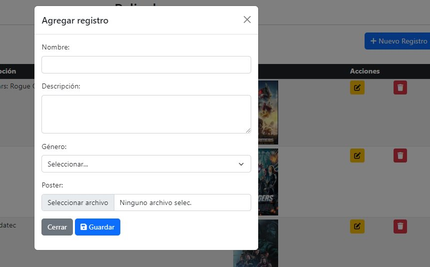

# CRUD con modals, PHP, MYSQL, BOOTSTRAP PERO CON PDO

 CRUD usando 2 tablas relacionadas pelicula y géneros, dónde también usamos imágenes pero con PDO.
 Se agregó archivo validarForm, alertas de "Registro agregado, editado, eliminado."

 Se agregó el 2do CRUD para los géneros de películas.

## TECH & TOOLS :wrench:

* Html
* Css
* PHP
* MYSQL
* Bootstrap
* Conexión PDO a base de datos
* Uso de modales de bootstrap
* Uso de sesiones

## SCREENSHOT

